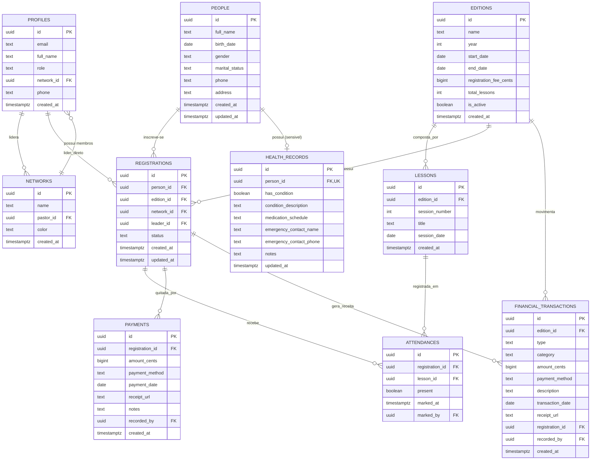

# Arquitetura do Sistema — Universidade da Vida (Bereana)

Este documento descreve a arquitetura técnica, modelo de dados, políticas de segurança, estratégia offline e padrões de implementação do sistema Universidade da Vida — Bereana.

---

## 1. Estrutura de Pastas por Feature

A aplicação adota uma organização orientada a **Features (Vertical Slices)**, complementada por um módulo **Shared** para componentes e utilitários transversais.

```
src/
├── app/                      # Setup de inicialização, roteamento central e providers
│   ├── routes.tsx            # Definição de rotas da aplicação
│   ├── App.tsx               # Shell principal, providers (QueryClient, AuthProvider)
│   └── main.tsx              # Ponto de entrada Vite
├── features/                 # Módulos de domínio independentes
│   ├── auth/                 # Autenticação, login, recuperação e autorização
│   │   ├── components/       # LoginForm, ProtectedRoute
│   │   ├── hooks/            # useAuth, usePermissions
│   │   └── types/
│   ├── pessoas/              # Gestão cadastral de pessoas (entidade perene)
│   │   ├── components/       # PersonList, PersonFormModal, PersonCard
│   │   ├── hooks/            # usePeople, usePersonMutations
│   │   └── types/
│   ├── inscricoes/           # Inscrições em edições, ficha de saúde restrita
│   │   ├── components/       # RegistrationList, HealthInfoModal (acesso restrito)
│   │   ├── hooks/            # useRegistrations, useHealthRecord
│   │   └── types/
│   ├── presenca/             # Chamada e frequência (Offline-First)
│   │   ├── components/       # AttendanceGrid, SyncBadge, OfflineNotice
│   │   ├── hooks/            # useAttendance, useOfflineQueue
│   │   ├── lib/              # attendanceQueue.ts (IndexedDB persistence)
│   │   └── types/
│   ├── financeiro/           # Pagamentos, caixa, receitas e despesas
│   │   ├── components/       # PaymentModal, CashFlowView, TransactionList
│   │   ├── hooks/            # usePayments, useCashSummary
│   │   └── types/
│   └── edicoes/              # Configuração de edições anuais e aulas/palestras
│       ├── components/       # EditionSelector, LessonManagerModal
│       ├── hooks/            # useEditions, useLessons
│       └── types/
└── shared/                   # Código transversal reaproveitável
    ├── components/           # UI primitives (Button, Modal, Input, ErrorBoundary, LoadingState)
    ├── lib/                  # supabase.ts (cliente tipado), idb.ts
    ├── hooks/                # useOnlineStatus, useDebounce
    ├── types/                # database.ts (gerado via Supabase CLI), common.ts
    └── utils/                # formatCurrency, formatDate, validationHelpers
```

### Regras de Escopo e Limites de Arquivo
- **Componentes:** máximo de 250 linhas. Componentes maiores devem ser quebrados em subcomponentes internos na mesma feature.
- **Arquivos:** máximo de 400 linhas.
- **Imports:** features importam de `shared/`, mas **nunca** importam diretamente código interno de outra feature (comunicação entre features ocorre via rotas, URL params ou queries compartilhadas).

---

## 2. Modelo Relacional Completo (PostgreSQL)

### Diagrama Entidade-Relacionamento (Mermaid)



### Justificativas de Normalização
1. **Separação `people` e `registrations`:** Uma pessoa é cadastrada uma única vez e possui histórico vitalício. A inscrição representa o evento com ano, líder, rede e custos específicos.
2. **Isolamento de `health_records` (1:1 restrito):** Dados sensíveis de saúde não podem trafegar no mesmo select das pessoas. O isolamento em tabela separada permite RLS restrita exclusiva para coordenação/secretaria, garantindo conformidade com a LGPD.
3. **Normalização de `payments` e `financial_transactions`:** Pagamentos de inscrições são parcelados (Pix + Dinheiro, etc.). A tabela `payments` registra as parcelas específicas da inscrição; `financial_transactions` é o livro-caixa global do evento (compras de alimentos, transporte, etc.).
4. **Centavos (`bigint`):** Todos os campos de valor monetário usam centavos inteiros (`amount_cents`), eliminando erros de arredondamento de ponto flutuante.

---

## 3. Desenho de Autorização (RBAC) e RLS sem Recursão

### Papéis do Sistema (`user_role`)
```sql
CREATE TYPE user_role AS ENUM ('coordinator', 'secretary', 'network_leader', 'viewer');
```

### Prevenção de Recursão Infinita em Policies
Quando uma policy da tabela `profiles` consulta `profiles`, ou quando uma policy de `registrations` faz um subselect em `profiles` que possui RLS, o Postgres pode entrar em loop recursivo ou degradar a performance (`O(N)` queries).

**Solução:** Funções auxiliares com atributos `SECURITY DEFINER` e `STABLE`:
```sql
-- Busca o papel do usuário autenticado sem disparar RLS
CREATE OR REPLACE FUNCTION auth_user_role()
RETURNS user_role
LANGUAGE sql
STABLE
SECURITY DEFINER
SET search_path = public
AS $$
  SELECT role FROM profiles WHERE id = auth.uid();
$$;

-- Busca a rede do líder autenticado sem disparar RLS
CREATE OR REPLACE FUNCTION auth_user_network_id()
RETURNS uuid
LANGUAGE sql
STABLE
SECURITY DEFINER
SET search_path = public
AS $$
  SELECT network_id FROM profiles WHERE id = auth.uid();
$$;

-- Helper para verificação de privilégios elevados
CREATE OR REPLACE FUNCTION is_coord_or_sec()
RETURNS boolean
LANGUAGE sql
STABLE
SECURITY DEFINER
SET search_path = public
AS $$
  SELECT EXISTS (
    SELECT 1 FROM profiles 
    WHERE id = auth.uid() AND role IN ('coordinator', 'secretary')
  );
$$;
```

### Custom Claims no JWT vs. Consulta a Tabela
- **Custom Claims (`app_metadata`):** Usados para checagem rápida no frontend (ex.: exibição de abas e menus).
- **Consulta via função `SECURITY DEFINER` nas Policies:** Garante que a revogação de permissão ou troca de líder tenha efeito **imediato** no banco de dados, sem precisar aguardar expiração do token JWT.

### Políticas de RLS Principais

| Tabela | Coordenação / Secretaria | Líder de Rede | Outros Usuários |
|---|---|---|---|
| `profiles` | Leitura total / Edição | Leitura própria e da sua rede | Leitura própria |
| `people` | Leitura e escrita total | Leitura de pessoas da sua rede | Apenas leitura restrita |
| `health_records` | **Acesso total** | **Acesso negado (0 linhas)** | **Acesso negado** |
| `editions` | Leitura e escrita total | Leitura apenas | Leitura apenas |
| `registrations` | Leitura e escrita total | Leitura e criação para sua rede | Bloqueado |
| `attendances` | Leitura e escrita total | Registro de presença da sua rede | Bloqueado |
| `payments` | Leitura e escrita total | Visualização do status da sua rede | Bloqueado |
| `financial_transactions` | Acesso total | Bloqueado | Bloqueado |

---

## 4. Views e Funções de Domínio

Em conformidade com a regra de manter o Postgres como fonte da verdade:

1. **`v_registration_payment_status` (Status Financeiro da Inscrição):**
   - Agrega a soma de pagamentos da inscrição (`COALESCE(SUM(amount_cents), 0)`).
   - Compara com a taxa da edição (`editions.registration_fee_cents`).
   - Retorna: `total_paid_cents`, `balance_due_cents`, `payment_status` (`'pending'`, `'partially_paid'`, `'paid'`).

2. **`v_registration_attendance_summary` (Frequência do Participante):**
   - Agrega total de presenças registradas vs total de aulas da edição.
   - Retorna: `attended_lessons`, `total_lessons`, `attendance_percentage`.

3. **`v_edition_financial_summary` (Resumo Geral do Caixa):**
   - Total de receitas (inscrições + avulsas), total de despesas, saldo líquido e pendências a receber.

4. **Função `mark_attendance_batch(p_records jsonb)`:**
   - Permite processar lote de presenças sincronizadas da fila offline em transação única atômica.

---

## 5. Estratégia de Auditoria por Trigger

Tabelas críticas (`health_records`, `payments`, `financial_transactions`, `registrations`) possuem trigger automático para a tabela `audit_logs`:

```sql
CREATE TABLE audit_logs (
    id uuid PRIMARY KEY DEFAULT gen_random_uuid(),
    table_name text NOT NULL,
    record_id uuid NOT NULL,
    action text NOT NULL, -- 'INSERT', 'UPDATE', 'DELETE'
    old_data jsonb,
    new_data jsonb,
    performed_by uuid REFERENCES auth.users(id),
    performed_at timestamptz DEFAULT now()
);
```

---

## 6. Estratégia Offline (Presença / Chamada)

### Arquitetura da Fila Local
- **Engine de Persistência:** IndexedDB via biblioteca leve `idb-keyval`.
- **TanStack Query Persister:** Cache de leitura persistido no IndexedDB para carregamento instantâneo da lista mesmo em modo avião.
- **Fila de Mutações (`attendance_offline_queue`):**
  - Cada toque na chamada insere uma mutação na fila local com: `{ id, registrationId, lessonId, present, timestamp, retryCount }`.
  - Atualização otimista imediata na UI (`onMutate`).
- **Resolução de Conflitos:** *Last-Write-Wins (LWW)* com base no `timestamp` da marcação. Em caso de re-sincronização, o registro com carimbo de tempo mais recente prevalece.
- **Indicador Visual na UI:** Componente `<SyncBadge />` na barra superior:
  - 🟢 *Sincronizado* (0 pendentes, online)
  - 🟡 *Sincronizando...* (tentando enviar itens)
  - 🟠 *X pendentes (Offline)* (dispositivo desconectado, dados seguros localmente)
  - 🔴 *Falha na sincronização* (alerta com botão de retentativa manual)

### Critério de Escala para PowerSync
- **Solução Inicial (IndexedDB Queue):** Ideal e suficiente para a tela de presença (volume de dados pequeno, conflitos raros de LWW).
- **Critério para migrar para PowerSync:** Se a coordenação exigir que o cadastro completo de pessoas, finanças e edição de registros inteiros funcionem offline de forma bidirecional com relacionamentos complexos.

---

## 7. Estratégia de Realtime: Onde Usar vs. Onde Evitar

- **Onde o Realtime é Obrigatório:**
  - **Fluxo do Caixa / Painel Financeiro:** Para que a coordenação veja entradas de inscrições e pagamentos em tempo real sem F5 durante dias de evento.
  - **Painel Geral de Presença da Coordenação:** Monitoramento de entrada de participantes no dia do retiro/encontro.
- **Onde Realtime é Peso Morto (Desativado):**
  - Cadastro de Pessoas, Configuração de Edições e Ficha de Saúde (geram conexões WebSocket ociosas, consumo de bateria em smartphones e tráfego de dados desnecessário).

---

## 8. Estratégia de Testes por Camada

1. **Testes Unitários (Vitest):**
   - Formatação monetária (centavos para R$ e vice-versa), cálculo de datas e idades.
   - Validações de Schemas Zod (formulários).
   - Componentes utilitários de UI isolados (Badge, Input, Button).
2. **Testes de RLS e Banco de Dados (`supabase test db` / pgTAP):**
   - Teste de isolamento de saúde: garantir que `network_leader` recebe 0 registros da tabela `health_records`.
   - Teste de escopo de rede: líder só visualiza inscrições da sua própria rede.
   - Teste de integridade de valores monetários e constraints.
3. **Testes E2E (Playwright em Viewport 390px):**
   - Fluxo de login e proteção de rotas.
   - Fluxo de chamada em modo offline (simulação com `context.setOffline(true)` no Playwright, gravação na fila e sincronização ao religar).

---

## 9. Plano de Rollout em Fases

- **Fase 1 (Fundação & Scaffolding):** Vite + React 19 + TypeScript strict + Tailwind v4 + Supabase local + Layout Shell + ErrorBoundary + CI.
- **Fase 2 (Autenticação, Perfis e RBAC):** Login, vinculação de perfil com rede, RLS base e helper functions `SECURITY DEFINER`.
- **Fase 3 (Pessoas & Edições):** Cadastro contínuo de pessoas e configuração de edições anuais.
- **Fase 4 (Inscrições & Ficha de Saúde):** Inscrições vinculadas a líderes/redes e módulo de saúde com RLS restrita.
- **Fase 5 (Presença Offline-First):** Chamada offline com fila IndexedDB, indicador visual de sync e batch sync.
- **Fase 6 (Financeiro & Caixa do Evento):** Registro de pagamentos, fluxo de caixa, despesas e fechamento de evento.
- **Fase 7 (Relatórios Impressos, Fichas e Crachás):** Layouts específicos para impressão mobile/desktop e exportação PDF.
